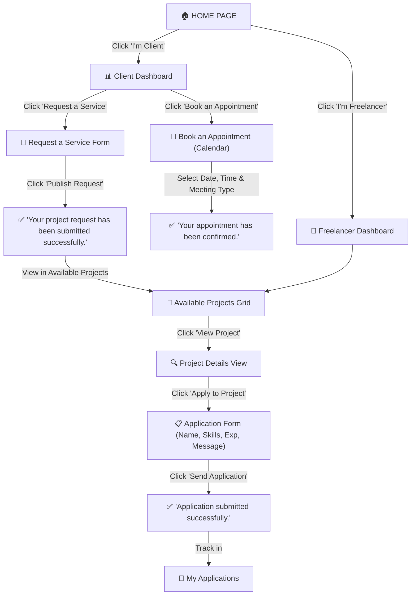

# DevPulse — Modern Development Services Platform

> A modern, professional SaaS web platform prototype connecting clients who need development services with vetted freelancers and developers.


---

## 🚀 Overview

**DevPulse** provides an end-to-end interactive prototype demonstrating the complete user experience for two distinct user personas:

- **Client**: Porting project ideas into digital reality, requesting development services, and scheduling discovery meetings.
- **Freelancer**: Browsing real client projects, reviewing technical specifications, and submitting structured developer applications.

---

## 🎯 Key Prototype Features & User Flows

### 1. Home Page
- **Navigation Bar**: Quick access to Home, Services, Projects, About, and Contact.
- **Hero Section**:
  - **Headline**: *"Transform your idea into a digital product."*
  - **Description**: Clear value proposition explaining how clients can request services or schedule meetings with the development team.
  - **Two Large CTAs**:
    - **"I'm Client"** → Navigates directly to the **Client Dashboard**.
    - **"I'm Freelancer"** → Navigates directly to the **Freelancer Dashboard**.
- **Interactive Capabilities Catalog**: Highlights Web Development, Mobile Development, E-commerce, UI/UX Design, and Other custom solutions.
- **Featured Projects**: Highlights live projects actively seeking developer proposals.

### 2. Client Dashboard
- **Dedicated Sidebar**:
  - `Dashboard` (Overview with metrics and quick actions)
  - `My Projects` (Tracking submitted project requests)
  - `Request a Service` (Direct form access)
  - `Appointments` (Calendar booking & scheduled meetings)
  - `Profile` (Verified client status, NDA compliance, billing)
- **Two Primary Action Cards**:
  - **Request a Service**: *"Describe your project and tell us what you need."* (Button: `Request a Service`)
  - **Book an Appointment**: *"Schedule a meeting with our development team."* (Button: `Book an Appointment`)
- **Recent Projects & Upcoming Appointments**: Live visual cards showing real-time updates.

### 3. Request a Service Page
- **Form Fields**:
  - `Project Name`
  - `Service Type`: Options include:
    - *Web Development*
    - *Mobile Development*
    - *E-commerce*
    - *UI/UX Design*
    - *Other*
  - `Project Description`
  - `Budget` (with quick preset selectors)
  - `Deadline`
- **Main Action Button**: `Publish Request`
- **Confirmation Screen**:
  - *"Your project request has been submitted successfully."*
  - Instant visibility in the Freelancer Available Projects feed.

### 4. Appointment Page (Calendar Booking)
- **Title**: *"Book an Appointment"*
- **Calendar-Based Interface**:
  - Interactive monthly calendar with weekday slot selection.
  - Live available time slots.
  - **Meeting Type Options**:
    - *Online Meeting* (with automatic Google Meet link)
    - *In-person Meeting* (at DevPulse Tech Studio)
- **Main Action Button**: `Confirm Appointment`
- **Confirmation Screen**:
  - *"Your appointment has been confirmed."*
  - Displays meeting summary, calendar synchronization, and location details.

### 5. Freelancer Dashboard
- **Sidebar**:
  - `Dashboard`
  - `Projects` (`Available Projects`)
  - `My Applications`
  - `Profile`
- **Main Section**: *"Available Projects"*
- **Project Cards**:
  - Project Title
  - Short Description
  - Service Type badge
  - Budget
  - Deadline
  - Required Skills tags
  - Button: `View Project`
- Realistic sample projects covering multiple categories.

### 6. Project Details Page
- Triggered by clicking `View Project` on any card.
- Comprehensive brief:
  - Project title & Client information
  - Service type
  - Full project description & context
  - Budget & Deadline
  - Required skills & Expected deliverables
- Action Button: `Apply to Project`

### 7. Application Page / Form
- Clean application modal with exact fields:
  - `Name`
  - `Skills`
  - `Experience`
  - `Application message`
- Action Button: `Send Application`
- Confirmation Message:
  - *"Application submitted successfully."*
  - Instantly tracked in `My Applications` tab.

---

## 🔄 User Navigation Flows



---

## 🛠️ Technology Stack

- **Framework**: [React 18](https://react.dev/) + [Vite 6](https://vitejs.dev/)
- **Styling**: [Tailwind CSS 3.4](https://tailwindcss.com/)
- **Icons**: [Lucide React](https://lucide.dev/)
- **Typography**: Plus Jakarta Sans & JetBrains Mono
- **State Management**: React Context (`PlatformContext`) with `localStorage` persistence

---

## 💻 Getting Started Locally

### Prerequisites
- Node.js (v18 or higher recommended)
- npm or yarn

### Installation

```bash
# Clone the repository
git clone https://github.com/ibrahimiyoussef8326-dotcom/formation-html-avancee.git

# Navigate into the project folder
cd formation-html-avancee

# Install dependencies
npm install

# Start the local development server
npm run dev
```

Open your browser at `http://localhost:5173` to test the prototype.

### Build for Production

```bash
npm run build
```

The optimized static production files will be output to the `dist/` directory.

---

## 📄 License
This project is open-source and available under the [MIT License](LICENSE).
